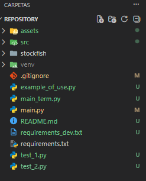
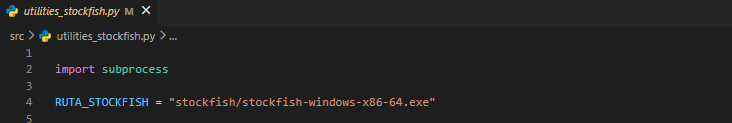

# Ajedrez en Python con Textual

Este es un proyecto de Ajedrez desarrollado en Python usando la libreria de aplicaciones en terminal Textual

## 📥 Clonar el repositorio

Para clonar el repositorio en tu máquina local, ejecuta el siguiente comando en tu terminal:

```sh
 git clone https://github.com/Paul-Asto/Game-Chess-in-Python-Textual.git
 cd Game-Tetris-in-Python-Textual
```

## 🛠️ Crear y activar un entorno virtual

Es recomendable utilizar un entorno virtual para gestionar las dependencias del proyecto.

### 🔹 En Windows (CMD o PowerShell)
```sh
python -m venv venv
venv\Scripts\activate
```

### 🔹 En macOS y Linux
```sh
python3 -m venv venv
source venv/bin/activate
```

## 📦 Instalar dependencias

Una vez activado el entorno virtual, instala las dependencias del archivo `requirements_dev.txt` con:

```sh
pip install -r requirements_dev.txt
```

## 📜 Dependencias del proyecto

Este proyecto usa la siguiente librería:

```
textual
```

## Descargar el motor de ajedrez de stockfish para obtener los movimientos enemigos
- Navega a la pagina https://stockfishchess.org/download/ para descargar el codigo fuente y el motor de ajedrez de stokfish
- Descomprime el archivo en la ruta principal del proyecto

 

- Verifica si la ruta del binario es correcta en el archivo utilities_stockfish

 

## 🚀 Ejecutar el proyecto

Para ejecutar el juego, simplemente corre:

```sh
python main.py
```


- La vista de la aplicacion deende del tamaño de fuente, asi que puedes modifirarla usando Ctrl + y Ctrl - 

<video src="assets/example_game.mp4" controls="controls" width="900px">
<video src="https://raw.githubusercontent.com/Paul-Asto/Game-Chess-in-Python-Textual/assets/example_game.mp4" controls="controls" width="900px">
</video>
## Ejemplo de manejo de la logica en codigo 


```

# Crear la clase ChessGame con el Builder, esta clase   maneja la logica del juego de ajedrez
from src.core.game import ChessGame
from src.builder import BuilderChess

game: ChessGame = BuilderChess.build_game()

# Inicializa el juego
game.init()


# Visualizacion de FEN
print(game.notation_forsyth_edwards)     #  rnbqkbnr/pppppppp/8/8/8/8/PPPPPPPP/RNBQKBNR w KQkq - 0 1

# Verifiar si el juego aun no termina
state: bool = game.in_running_game # True or False

# Visualizacion de datos con Rich
from src.term.term_view_components import get_view_term_board
from rich.console import Console

console = Console()

# Imprimir el tablero
view_board = get_view_term_board(game.board)
console.print(view_board)

'''

____________________________
|          Board            |
|___________________________|

   A   B   C   D   E  F   G   H  

8  ♖  ♘  ♗  ♕  ♔  ♗  ♘  ♖   8
7  ♙  ♙  ♙  ♙  ♙  ♙  ♙  ♙   7
6  Ｘ  Ｘ  Ｘ  Ｘ  Ｘ  Ｘ  Ｘ  Ｘ   6
5  Ｘ  Ｘ  Ｘ  Ｘ  Ｘ  Ｘ  Ｘ  Ｘ   5
4  Ｘ  Ｘ  Ｘ  Ｘ  Ｘ  Ｘ  Ｘ  Ｘ   4
3  Ｘ  Ｘ  Ｘ  Ｘ  Ｘ  Ｘ  Ｘ  Ｘ   3
2  ♙  ♙  ♙  ♙  ♙  ♙  ♙  ♙   2
1  ♖  ♘  ♗  ♕  ♔  ♗  ♘  ♖   1

   A   B   C   D   E  F   G   H  
'''


# Realiza un movimiento ejemplo: (d2d4, f7e6, g3f2, h8h6)
# Para promocion de peon se añade al final del movimiento el caracter de la ficha al cual sera promovido (q, r, b, n)
from src.core.protocol_uci import FormatUCI

str_mov = "d2d4"
mov_uci = FormatUCI(str_mov)

game.make_mov(mov_uci)

# Visualiza los cambios imprimiendo otra ves el tablero

console.print(view_board)

# reinicia el juego 
game.restart_game()


# ejemplo de obtencion de un movimiento de stockfish
from src.utilities_stockfish import get_mov_uci_chess_bot
fen: str = game.notation_forsyth_edwards # "rnbqkbnr/pppppppp/8/8/8/8/PPPPPPPP/RNBQKBNR w KQkq - 0 1"   FEN de una posición de ajedrez
#mejor_jugada = get_mov_uci_chess_bot(fen_inicial)

uci: str = get_mov_uci_chess_bot(fen)
print(uci) # Obtiene un best move para usarlo como un movimiento enemigo

```
